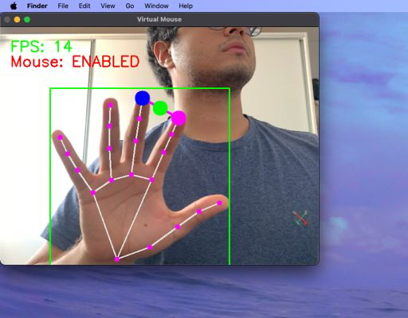

#  Virtual Mouse with Hand Tracking

A **gesture-based virtual mouse** using **OpenCV, Mediapipe, and PyAutoGUI**. This project allows you to **control your computer's mouse** using **hand gestures** through your webcam. Features include **cursor movement, clicking, scrolling, tab navigation, and more**.

---

## 📜 Original Inspiration  
This project is based on the article:  
[**Artificial Intelligence Virtual Mouse using Computer Vision and Python**](https://gautamaditee.medium.com/artificial-intelligence-virtual-mouse-using-computer-vision-and-python-88edfe2219dd)  
by *Gautam Aditee*.

I've **improved and expanded** the original project with:
- **Smoother cursor movement** 🖱️
- **More natural scrolling** using **finger spacing** 📜
- **More precise clicking detection** 👆
- **Toggle Mouse Functionality** by raising **5 fingers for 3 seconds** ✋
- **Better code organization & performance** 🏎️

---

## 🛠️ Features

✅ **Move Cursor** → Raise **only the index finger** and move your hand.  
✅ **Left Click** → Touch **index & middle fingers together**.  
✅ **Scrolling** → Move **index & middle fingers apart/closer**.  
✅ **Switch Tabs (Ctrl+Left/Right)** → Raise **thumb + index**, move left/right.  
✅ **Disable/Enable Mouse** → Raise **5 fingers for 3 seconds** to toggle mouse control.  
✅ **Drag & Drop (Optional)** → Pinch **thumb + index** to grab and release.  
✅ **Smooth Performance** → **FPS optimized** for better responsiveness.  

---

## 🎯 Hyperparameters & Customization

The **Virtual Mouse** system is controlled by several **hyperparameters**, allowing you to **tune sensitivity, responsiveness, and interaction boundaries**:

| **Hyperparameter** | **Default Value** | **Description** |
|--------------------|------------------|----------------|
| `wVideo` | `640` | Webcam frame width (in pixels). Adjust for different camera resolutions. |
| `hVideo` | `480` | Webcam frame height (in pixels). |
| `smoothing` | `10` | Controls cursor movement **smoothing** (higher = smoother but less responsive). |
| `frameR` | `80` | **Frame Reduction**: Creates a virtual boundary to avoid erratic movement near screen edges. |
| `mouse_enabled` | `True` | Keeps track of whether the mouse is **enabled or disabled** (can be toggled by raising 5 fingers for 3 sec). |

#### **How to Modify Hyperparameters**
You can **adjust these values** inside `VirtualMouse` class in `virtual_mouse.py`:

```
python virtual_mouse = VirtualMouse(wVideo=1280, hVideo=720, smoothing=5, frameR=50)
```

---

## 🖥️ Installation & Setup

Ensure you have Python installed.  
Run the following:
```bash
pip install -r requirements.txt
```

```bash
python app.py
```

---
## Testing


